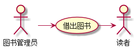

# 实验二：图书管理系统用例建模

| 学号 | 班级 | 姓名 | 照片|
|:----:|:-----:|:----:|:----:|
| 201510414326 | 软件（本）15-3 | 张宇 | 
## 1.图书管理系统的用例关系图
### 1.1用例图PlantUML源码如下：zu.png
    @startuml
    学生图书管理员 -up-> (借出图书)
    学生图书管理员 -up-> (归还图书)
    学生图书管理员 -up-> (查询图书)
    教师图书管理员 -down-> (维护书目)
    教师图书管理员 -down->(借出图书)
    教师图书管理员 -down-->(归还图书)
    教师图书管理员 -down->(查询图书)
    系统管理员 -->(增加图书)
    系统管理员 -->(删除图书)
    系统管理员 -->(修改图书)
    系统管理员 -->(查询图书)
    系统管理员 -->(日志查看)
    系统管理员 -->(用户修改)
    系统管理员 -->(系统维护)
    学生 -down->(查询图书)
    学生 -down->(预定图书)
    学生 -down->(取消预定)
    学生 -down->(查询自己借阅情况)
    学生 -down->(查询欠费情况)
    教师 -up->(查询图书)
    教师 -up->(预定图书)
    教师 -up->(取消预定)
    教师 -up->(查询自己借阅情况)
    教师 -up->(查询欠费情况)
    教师 -up->(查询自己学生借阅情况)
    @enduml
### 1.2. 用例图如下：

## 2. 参与者说明：
### 2.1学生图书管理员
主要职责是：负责帮助教师管理员给来图书馆借还图书的读者进行处理
### 2.2教师图书管理员
主要职责是：负责给读者借还图书进行处理，还要处理图书书目的问题
### 2.3系统管理员
主要职责是：负责图书馆的图书的增删改查，读者用户的增删改查，管理员的增删改查，系统的维护，日志的查看
### 2.4学生
主要职责是：能对图书进行查询，查询自己在图书馆的借书情况，查询欠费书籍的情况，预定和取消预定
### 2.5教师
主要职责是：能对图书进行查询，查询自己在图书馆的借书情况，查询欠费书籍的情况，预定和取消预定，并能查询自己的学生在图书馆的借书情况
## 3.用例规约表
### 3.1“借出图书”用例

|||
|:----:|:-----:|
| 用例名称 | 借出图书 |
| 参与者 | 学生图书管理员（主要参与者），教师图书管理员（主要参与者），学生（次要参与者），教师（次要参与者） |
| 前置条件 | 图书管理员已被识别和授权，该图书未借出 |
| 后置条件 | 存储借书记录，更新库存数量，所借图书状态为借出 |
| 主事件流 | 1.图书管理员将读者借书卡提供给系统；2.系统验证读者身份和借书条件；3.图书管理员将读者所借图书输入系统；4.系统记录借书信息，并且修改图书的状态和此书的可借数量；5系统累加读者的借书数量；6.重复3~5，直到图书管理员确认全部图书登记完毕；7.系统打印借书清单，交易成功完成 |
| 备注 | 图书馆开架借阅，读者找到书后办理借书手续，因此借书不需要验证库存，而且每本书都是可识别的 |