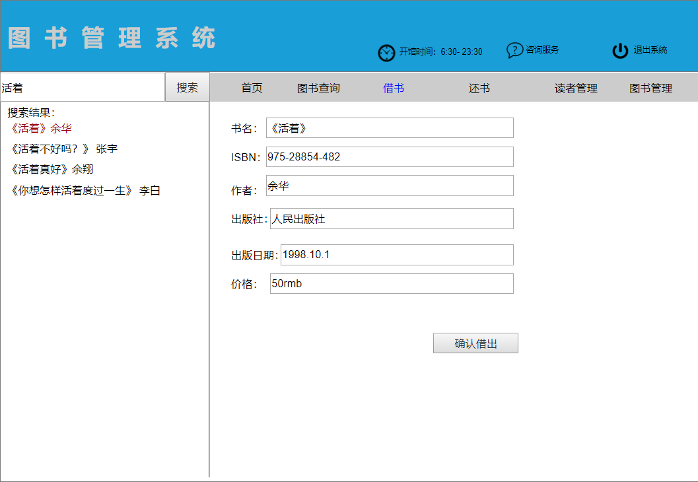

# 实验5：图书管理系统数据库设计与界面设计
|学号|班级|姓名|照片|
|:-------:|:-------------: | :----------:|:---:|
|201510414326|软件(本)15-3|张宇|[](./zhangyu.png)|

## 1.数据库表设计

## 1.1. 图书表
|    项目   |       字段名       |      类型与宽度     |   是否主键    |   是否允许空值  |  说明 | 
|:-------|:------------- | :----------|:----------|:---------|:-----|
|   图书名字 |     BookName    |   varchar(20)   |  否      |   否     |    |
|   ISBN  |     publishingID    |   varchar(14)   |  否      |   否     |  |
|   价格  |     Price    |   float   |  否      |   否     |    |
|   简介  |     Introduction    |   varchar(100)   |  否      |   否     |  超过部分不保存 |
|   出版日期  |     PublishTime    |   date   |  否      |   否     |    |
|   出版社 |   Publisher  |   varchar(20)   |  否      |   否     |  |
|   状态 |   State |   varchar(10)   |  否      |   否     |  |
## 1.2. 学生用户信息表
|字段|类型|主键，外键|可以为空|默认值|约束|说明|
|:-------:|:-------------:|:------:|:----:|:---:|:----:|:----------|
|学生卡ID|varchar2(20)|主键|否| | | 学生的学号|
|身份证ID|varchar(20)||否| | | |
|可借限额|Int|主键|是|空| | 分数，这个值为空表示没有借书资格|
      
## 1.3 图书管理员信息表
|    项目   |       字段名       |      类型与宽度     |   是否主键    |   是否允许空值  |  说明 | 
|:-------|:------------- | :----------|:----------|:---------|:-----|
|   管理员ID  |     librarianID    |   varchar(12)   |  是      |   否     | 加密保存，系统管理员为每个图书管理员分配唯一的包含字母和数字的管理员ID，管理员通过ID和姓名登录 |
|   姓名  |     librarianName    |   varchar(15)   |  否      |   否     |  加密保存，为了安全，名字可不必为真实名字  |
## 1.4 系统管理员信息表
|    项目   |       字段名       |      类型与宽度     |   是否主键    |   是否允许空值  |  说明 | 
|:-------|:------------- | :----------|:----------|:---------|:-----|
|   管理员ID  |     administratorID    |   varchar(12)   |  是      |   否     | 加密保存，系统管理员自己设定管理员ID，管理员通过ID和姓名登录，如忘记ID，可通过登录数据库修改 |
|   姓名  |     administratorName    |   varchar(15)   |  否      |   否     |  加密保存，为了安全，名字可不必为真实名字  |
***

## 2. 借书界面设计
[](./jieshu.png)
- 用例图参见：借书用例
- 类图参见：借出图书类
- 顺序图参见：借出顺序图
- API接口如下：

1. 接口调用请求说明

- 功能：用于获取全部分类
- 支持格式:json/xml
- 请求地址：http://api.yi18.net/book/bookclass
- 请求示例:请求示例：http://api.yi18.net/book/search?keyword=活着
- 请求方法：GET
- 请求参数： Allow

| 参数名称       | 必填  | 说明 |
|:--------------|:-----|:-------|
| access_token | 是    | 用于验证请求合法性的认证信息 |
|method       |是     |固定为GET|
|version      |是     |客户端版本号|
|resource_name| 否|图书名称|
|author|否|作者|      
|publish_house|否|出版社|
|publish_year|否|年份|
|type|否|图书类型|
|ISBN|否|图书ISBN编号|

- 返回实例：
```
{
       {  
       "resultcode":"200",  
       "reason":"Success",  
       "result":{  
       "data":[  
         {  
            "title":"活着",  
            "catalog":"社会 哲学 文学 ",  
            "tags":"一场人间炼狱 ",  
            "sub1":"《活着》",
           "img":"http://api.yi18.net/book/bookclass/img/379cdafe13f92d62e99388182a6d08ec.jpg",  
            "reading":"8091人阅读",  
            "online":"京东商城:http://book.jd.com/20587462876.html 
            "bytime":"2018年4月28日"  
          }  
        ],  
       "totalNum":"9",  
       "pn":0,  
       "rn":"1"  
        }  
       }  
```
- 返回参数说明：
    
|参数名称|说明|
|:-------:|:-------------: |
|result|返回信息|
|data|获取的图书信息|
|200|返回码|

